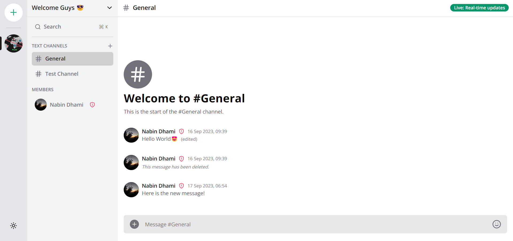
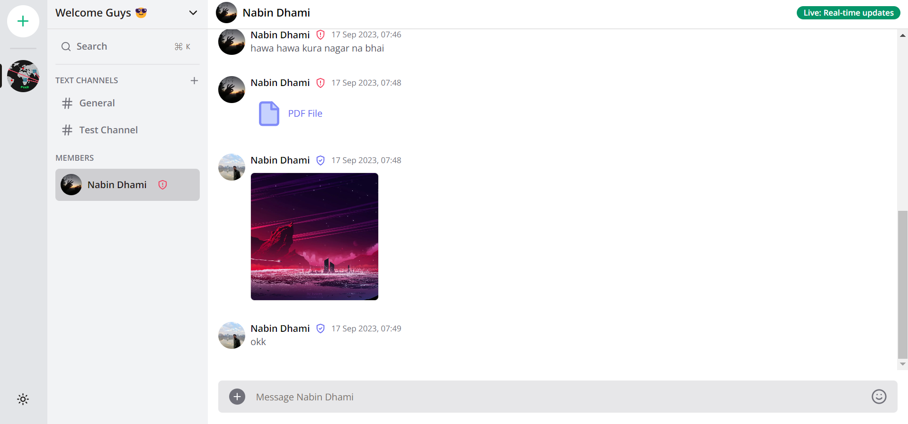
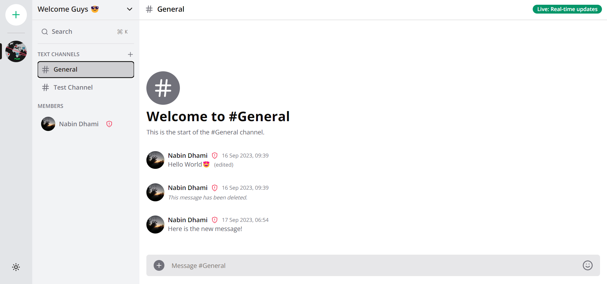
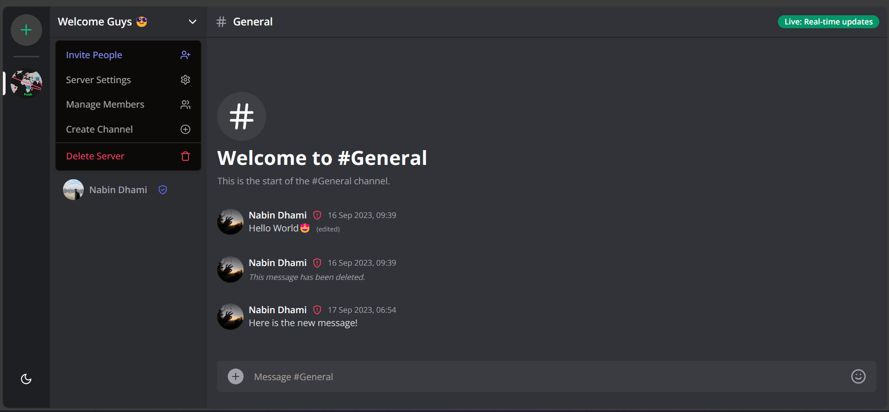
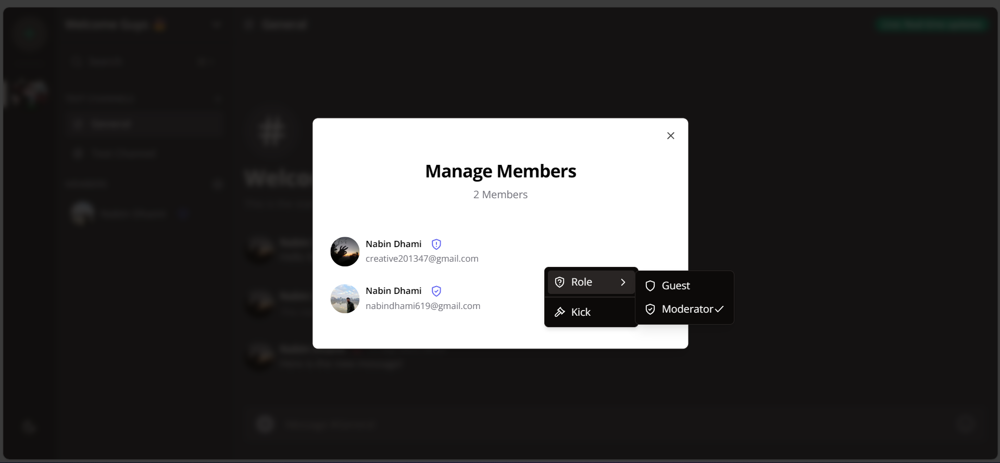
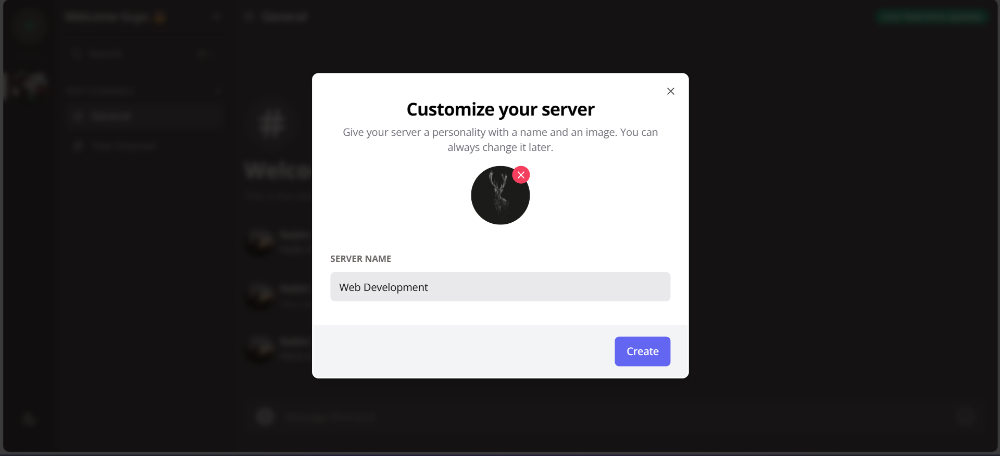
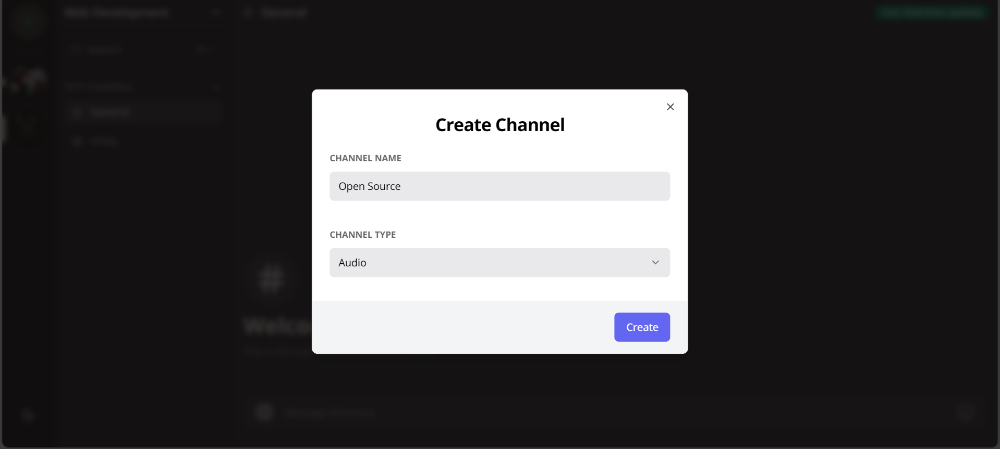
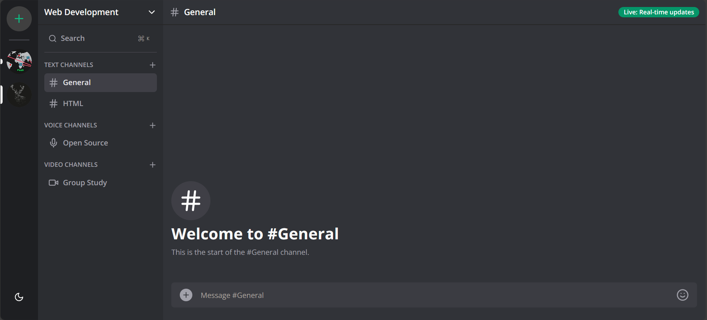
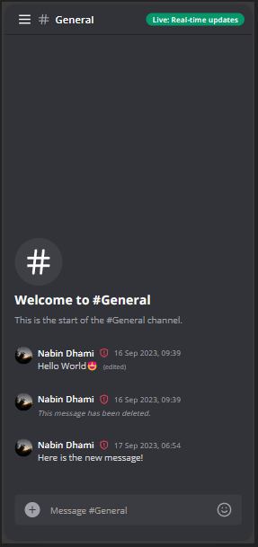
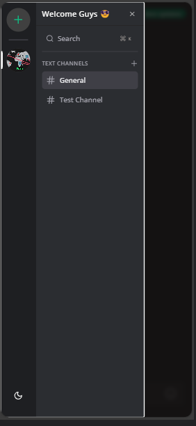

# [Fullstack Discord Clone | Next.js 13, Socket.io, Clerk, Prisma ](https://www.youtube.com/watch?v=ZbX4Ok9YX94&t=38160s&ab_channel=CodeWithAntonio)

## Features

- Real-time messaging using Socket.io
- Send attachments as messages using UploadThing
- Delete & Edit messages in real time for all users
- Create Text, Audio and Video Channels
- 1:1 conversation between members
- Member management (Kick, Role change Guest / Moderator)
- Unique invite link generation & full working invite system
- Infinite loading for messages in batches of 10 (tanstack/query)
- Server creation and customization
- Beautiful UI using TailwindCSS and ShadcnUI
- Full responsivity and mobile UI
- Light / Dark mode
- Websocket fallback: Polling with alerts
- ORM using Prisma
- Authentication with Clerk

> [Authentication](https://clerk.com/docs/quickstarts/nextjs)
> | [Dark Mode](https://ui.shadcn.com/docs/dark-mode/next)
> | [Upload Things](https://docs.uploadthing.com/getting-started)
